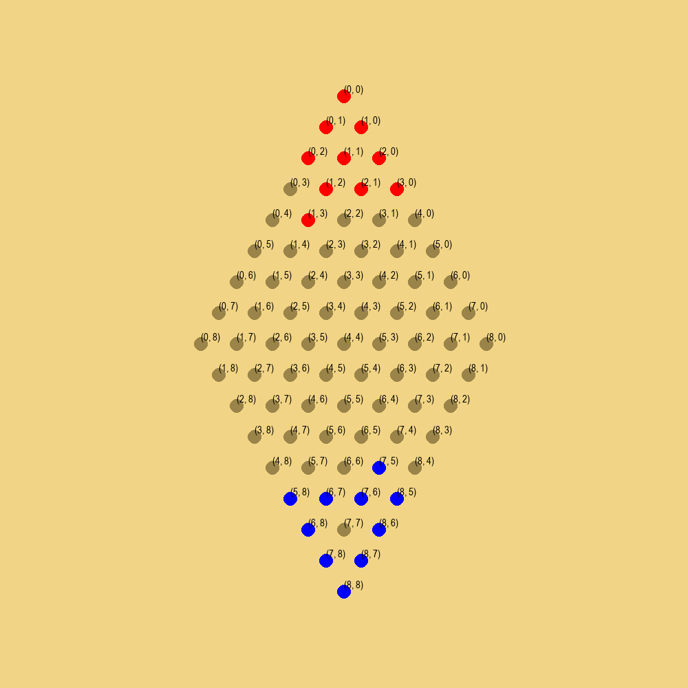

# Chinese Checkers AI

Welcome to my Chinese Checkers AI project.

This was a personal project to create an AI that can play one of my favourite games: Chinese Checkers. 

### Technical Information

For simplicity, I reduced the game to a two-player version. The game mechanics were written by me and the environment was built using the PettingZoo Python library. The training code was adapted from the AgileRL website and modified to suit the game's needs. An example of a game board is given below:

The training was done by having multiple DQN agents play against each other. Each DQN agent was running on a self-evolving convolution neural network and agents were also evolved by measure of fitness.

### Results

As it stands chinese checkers turned out to be quite a heavy game with many different possible actions and my personal computer was not quite powerful enough to create a strong model that challenged me. Nevertheless, the model understands the game and can (eventually) beat a very weak player.
